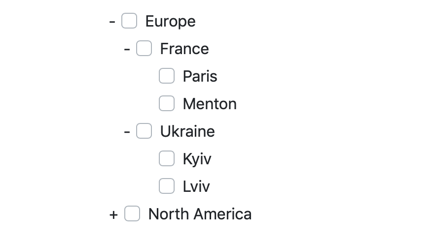

# Create checkbox trees with `react-checkbox-tree`

[](https://badge.fury.io/js/checkbox-tree-react)
[](https://coveralls.io/github/MarkusBansky/react-checkbox-tree?branch=master)
[](https://travis-ci.org/MarkusBansky/react-checkbox-tree)



Hi! I am a software developer and made this package to simplify life for some developers seeking similar solution for their react projects.
This package let's you create a simple but custom checkbox tree from any data type you have, and implement it in your react project with a simple component.

## Instalation
It is as simple as it looks like:
`npm install react-checkbox-tree`

### Depencies
This project depends on `fontawesome` and `react`.

## Usage
You will need to do two steps first in order to get ready to use your data in the checkbox tree.

### Data
First, get your data prepared:

```javascript
const data = [
  { // These are your main root nodes
    'id': 1,
    'name': 'Group A',
    'subGroups': [
      { // These are the children of the main nodes
        'id': 1,
        'name': 'Sub group 1',
        'leaves': [
          { // These are leaves without nodes
            'id': 1,
            'name': 'Mark'
          },
          //...
        ]
      },
      //...
    ]
  },
  //...
]
```
This part of code above creates a simple tree with one root node, that has one childand that child has one leaf.

If needed you can set the `checkedState` field in each node to define its' initial checked state. The `checkedState` parameter can be set to `checked` or `unchecked` as a string.

### Accessors
The **accessor** has a structure like this:

```javascript
{
  label: '**enter the name of the field in your data element to display in the tree node**',
  value: '**enter the name of the value field for the node**',
  type: '**this is used to group your selection of checkboxes by tree levels**',
  leaves: '**this is a name of the field to get children for this node**'
}
```

Now you have to make accessors to each branch level in your data, so that the tree knows how to access your data. This can be done as follows for the above example:

```javascript
const accessors = [
  {
    label: 'name',
    value: 'id',
    leaves: 'subGroups',
    type: 'root'
  },
  {
    label: 'name',
    value: 'id',
    leaves: 'leaves',
    type: 'group'
  },
  {
    label: 'name',
    value: 'id',
    type: 'leaf'
  }
]
```

### Tree Element
Now you can use the tree element and add it to your view, notice that you are passing the `data` and `accessors` variables into the component:

```javascript
<CheckboxTree data={data} accessors={accessors} />
```

The **CheckboxTree** element can also have `onChange` parameter that accepts a `method(items)` as  value.

## Api

#### CheckboxTree
A main element that holds the tree of checkboxes from the data that is build with accessors.

- **data**
  A javascript *structure* that holds all the data and could be also retreived from API call or other methods. Must be an array.
- **accessors**
  An *array* of *structures* that contain ccessors to the data levels for the tree. The *data* can contain a stacked tree with different parameters, here you define  which parameters to choose for name, value and type, nd also how to select child nodes.
  {
    label: 'paramForLabel',
    value: 'paramForValue',
    type: 'anyTypeName',
    leaves: 'paramForChildren'
  }
- **onChange**
  Accepts a *function* with a single parameter *items* which is a structure of tree *types* that represent different levels of the tree and values selected on that levels.


## License

MIT
